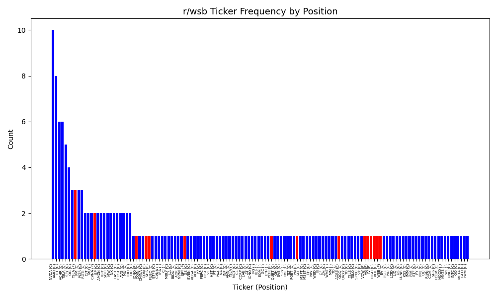
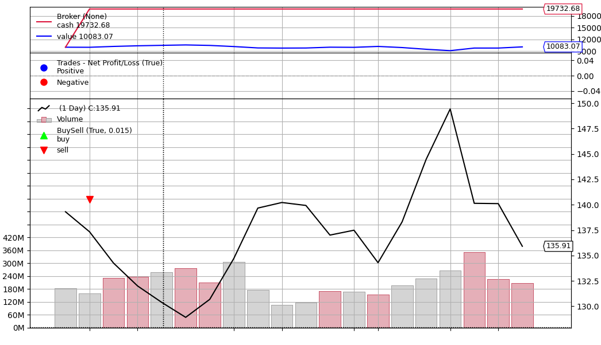
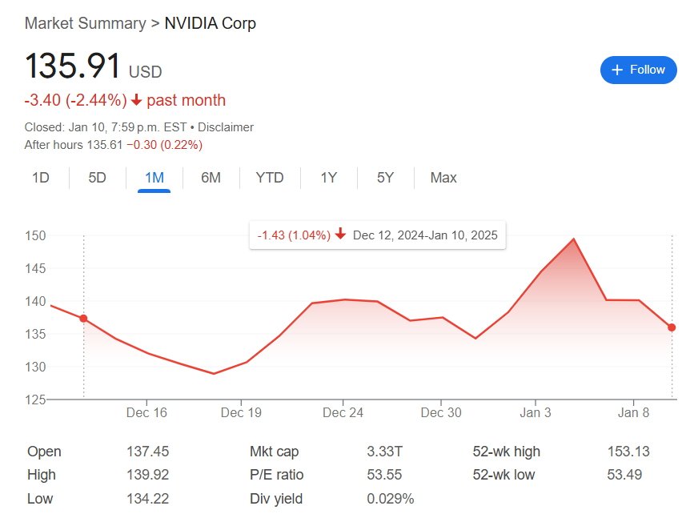

# WallStreetBets Inverse Trader

A trading bot that analyzes posts on r/wallstreetbets and buys inverse positions on the most frequent YOLOs.

I seriously do not recommend trying to follow any of the information in this repo, as stocks are complicated and the positions here are generated purely off of reddit. I like to think of this as an example of the "Monkey throwing darts" porfolio strategy, and any consistent longterm profits/losses is likely due to luck. 

Since reddit posts come in a variety of shapes and sizes, there is inevitably a portion of positions that fall through my scraping efforts.

## Features
- Analyzes Reddit posts by flair.
- Backtests trading strategies using `backtrader`.
- Fetches financial data using `yfinance`.

### r/wsb YOLOs Sorted by Position and Frequency for Dec 2024


### Example Inverse Trade Based on Most Popular Postition in Dec 2024 (NVDA Calls)


### NVDA Preformance During Time Period


In this example, 71 shares of NVDA was sold on Dec 12 at $137.08 and covered on Jan 10 at $135.91 after 30 days since the ±8% return condition was not met. This profited of $1.17/share, at a net profit of $83.07.

## Trading Conditions
 - $10,000 initial value
 - ±8% percentage exit strategy or after 30 days
 - Trades are long/short positions
   
## Prerequisites
- Python 3.9+
- Tesseract 
- Reddit API credentials (see below).
- Requirements listed

## **Setup Instructions**

To fetch posts from Reddit, you need to set up Reddit API credentials. Follow these steps:

1. **Log in to your Reddit account** and go to the [App Preferences](https://www.reddit.com/prefs/apps) page.

2. **Create a new app**:
   - Click the **"Create App"** or **"Create Another App"** button.
   - Select **"script"** as the app type.


### **1. Clone the Repository**
Run the following command to clone the repository to your local machine:
```bash
git clone https://github.com/YourUsername/wsb-inverse-trader.git
cd wsb-inverse-trader
```
### **2. Setup venv and dependencies**
```bash
python -m venv venv
source venv/bin/activate  # On Windows: venv\Scripts\activate
pip install -r requirements.txt
```

Download pytesseract
### **3. Setup credentials**

Copy .env.example to .env and fill in your Reddit API credentials.

### **4. Run script**

python main.py

To see the frequency of the scrapped data, run:

```
python graph.py graph <data file>
```
or to see frequency independent of positions:

```
python graph.py graph_freq <data_file>
```

